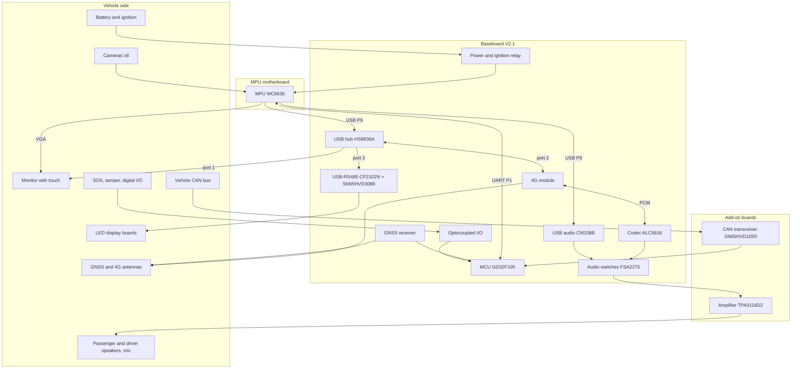

# Hardware Architecture

> **Status:** Draft · **Updated:** 2026-09-11 · **Sources:** baseboard V2.1, amplifier 50 W and CAN sheet schematics. The MPU motherboard schematic is not available yet, so everything on that board is TBD.

This page is the map: for each product section it names the components that carry the function, traces the signal path through the boards, and lists the driver or firmware module each processor needs. Pin-level detail lives in the [hardware pages](../product/hardware.md); the functional behaviour lives in the [product sections](../sections/camera/overview.md).

Driver names assume a Linux-based MPU (**verify**; if the MPU runs Android or an RTOS the equivalents differ). Items marked **verify** are inferred from the schematics rather than printed on them.

## System view

## Where each section runs

| Product section | MPU | MCU | Baseboard hardware | Add-on or external |
|---|---|---|---|---|
| Power and ignition | Requests power hold, shuts down | Senses ignition, drives the relay, measures battery | K1, U21, U24–U27, ADC dividers | External 24 V → 12 V converter (verify) |
| Camera management | Everything | SOS trigger | Monitor connectors P10/J1, USB hub, external USB | Cameras and storage on the MPU board (TBD) |
| PIS management | Route logic, announcements, LED boards | Supplies GNSS fixes | CM108B, audio switch U4, CP2102N + RS-485 | Amplifier add-on, LED boards |
| CAN health monitoring | Processing, display, reporting | Reads and decodes CAN | MCU CAN controllers | CAN add-on |
| Backend communication | TCP client, FTP client | — | USB hub, 4G module, SIM/eSIM | 4G antenna |
| Voice calls | AT commands, switch control | — | 4G module PCM, ALC5616, switches U4/U5 | Amplifier add-on, mic, driver speaker |
| GPS tracking | Consumes fixes | Reads the GNSS module | U11, ANT1, BT1 | GNSS antenna |
| Safety I/O and sensors | Consumes events | Reads inputs, drives outputs | U14, U15, MPU-6050, LEDs | Buttons, switches, lamps |
| Settings | Stores and serves settings | Holds its own copy | — | USB drive for backup |

---

## 1. Power and ignition

| Component | Ref | Role |
|---|---|---|
| Power input | J6 | B+, B−, V_IGN from the vehicle; loop to the external converter (verify) |
| Reverse and transient protection | D22, D23 (B540), D24, D20 (5KP36CA) | Protects the board from the vehicle supply |
| Ignition sense supply | U21 LM2596S-3.3 | Turns V_IGN into a 3.3 V "ignition on" signal |
| Ignition relay | K1 with Q5, D26, D27 | Switches +12 V to the whole system |
| 5 V buck | U24 TPS5450 | +12Vout → +5V for everything digital |
| 3.3 V regulators | U26 (MCU), U25 (GNSS), U27 (4G, 3 A), U22/U23 (codec 3.3 V and 1.8 V) | Each with its own enable where switched |
| Battery sensing | R72/R76, R73/R77 dividers, D13/D14 zeners | +12 V rail and battery input to the MCU ADC |

**Flow**

1. Ignition on → U21 produces V-IGNsense → Q5 closes K1 → +12Vout live → U24 makes +5 V → the MCU rail (U26) comes up when MCU_PWR_EN is high (**verify** whether the MPU or the board drives it) → the MPU board receives +12 V on P11 and boots.
2. The MCU sets REL-EN (PA8) high as soon as it runs, so the relay stays closed even if the ignition signal is lost.
3. The MCU enables GNSS power (PA7) and the MPU enables 4G power (GSM_PWR_EN on P1) when they want those modules.
4. Ignition off → V-IGNsense drops → MCU sees PA1 low and PA0 wake edge → tells the MPU over UART → the MPU finishes recording and uploads, then sends "ready to power off" → the MCU drops REL-EN → K1 opens → everything is off except the ignition-sense circuit.
5. While running, the MCU samples both battery dividers on the ADC (PA4, PA5) and reports the voltages.

**Drivers and firmware**

- MCU: GPIO with external interrupt on PA0/PA1 (ignition), GPIO output PA8 (relay), PA7 (GNSS power), ADC on PA4/PA5, RTC on the 32.768 kHz crystal, independent watchdog.
- MPU: GPIO for GSM_PWR_EN (and MCU_PWR_EN if it exists), the power-off handshake in the [MPU ↔ MCU UART protocol](../code/mpu-mcu-uart.md), and an orderly shutdown of storage.

## 2. MPU ↔ MCU link

| Component | Ref | Role |
|---|---|---|
| Connector | P1 "µBRD IO" | UART TX/RX, GPIO0–2, GSM_PWR_EN, MCU_PWR_EN (verify), AMP_SW, CALL-SW |
| MCU UART | UART4 on PC10/PC11 | 3.3 V logic through 10 Ω, activity LEDs D9/D10 |

**Flow**: the MCU streams GNSS fixes, CAN health records, events and status to the MPU; the MPU sends configuration and commands back. GPIO0–2 are spare lines between the two processors (meaning TBD; candidates: MPU-ready, data-ready interrupt, shutdown request).

**Drivers and firmware**

- MCU: USART driver with DMA and ring buffers, framing/CRC layer, message handlers.
- MPU: a serial port (tty) on the SoC UART that reaches P1 (TBD which), plus the same protocol layer in the application.

## 3. Camera management

| Component | Where | Role |
|---|---|---|
| Cameras ×8 | MPU board, interface TBD | AHD (analogue HD over coax) would need video-decoder chips on the MPU board; IP cameras would need Ethernet; MIPI CSI would be direct |
| Video encoder | MPU SoC | H.264/H.265 encoding of 8 streams |
| Storage | MPU board, TBD | SSD, SD or eMMC for recordings |
| Display | MPU VGA → J1 → 200 Ω series R5–R9 → P10 → monitor | Live view and playback |
| Touch | Monitor → P10 → hub port 1 (or direct, varies by project) → MPU | Driver and technician input |
| Export | MPU → hub port 4 → L2, U2 ESD → P7 or P13 pins 11/13, 5 V through F2 | USB drive for exported footage |
| SOS trigger | SOS on P13 pin 10 → U15 optocoupler → MCU PB15 | Starts the panic clip flow |

**Flow (panic clip)**: SOS button → MCU PB15 interrupt, debounce → event over UART → MPU locks segments, cuts clips from storage → upload queue → 4G module (section 6) → backend FTP server → completion packet over TCP.

**Drivers and firmware**

- MPU: video capture (V4L2 for decoder chips or MIPI; RTSP client for IP cameras), SoC video encoder, display controller for VGA, USB HID multitouch for the touch panel, USB mass storage for export, the filesystem on the recording storage, and the recording/indexing application.
- MCU: GPIO interrupt on PB15 with debounce; event message.

Everything on the MPU board is TBD until its schematic is available.

## 4. PIS management

### LED display boards

| Component | Ref | Role |
|---|---|---|
| USB to UART | U18 CP2102N on hub port 3 | Appears to the MPU as a serial port |
| RS-485 transceiver | U19 SN65HVD3088E, direction from the CP2102N's GPIO.2 (auto RS-485 mode) | Half-duplex bus to the boards |
| Line protection | L3 choke, U20 SM712 TVS, 60.4 Ω + 60.4 Ω AC termination, 4.7 kΩ bias | |
| Connector | P13 pins 6 (A) and 8 (B) | To the vehicle harness |

**Flow**: the MPU writes a board-protocol frame to the serial port → CP2102N raises the direction line and transmits → the boards update → replies (if any) come back the same way. The link to the LED boards is the likely use of this port (**verify**: the boards' vendor protocol is TBD).

**Drivers**: MPU `cp210x` USB-serial driver (creates `/dev/ttyUSBn`); the CP2102N's RS-485 direction mode is set once in the chip's configuration; the board protocol is application code.

### Audio announcements

| Component | Ref | Role |
|---|---|---|
| USB audio | U28 CM108B on the direct USB port P9 pins 4–5 (or the hub, varies by project) | Sound card for the MPU: playback and mic capture |
| Speaker-path switch | U4 FSA2275, SEL = AMP_SW from the MPU via P1 pin 9 | Routes CM108B output to the announcement input or the driver-speaker input of the amplifier |
| Amplifier | Add-on board, TPA3116D2: right channel sums ANNOUNCE_L and R | Drives the passenger speakers |
| Connectors | P3 (to amplifier), P4 (from amplifier), P14 pins 1–4 (speakers) | |
| Position | GNSS fixes from the MCU over UART | Triggers the next-stop logic |

**Flow**: MPU decides a stop is due (from GNSS fixes) → sets AMP_SW to the announcement path → plays the audio file through the CM108B → U4 → ANNOUNCE_L/R → amplifier right channel → passenger speakers → restores AMP_SW if a call needs the path.

**Drivers**: MPU `snd-usb-audio` (USB Audio Class) for the CM108B; GPIO for AMP_SW; audio player and mixer in the application. The amplifier has no control lines.

## 5. CAN health monitoring

| Component | Ref | Role |
|---|---|---|
| Vehicle bus entry | P13 pins 1/3 (CAN1), 2/4 (CAN2) | From the harness |
| Transceiver | CAN add-on: U1 SN65HVD1050, L1 choke, U2 TVS, termination options | Converts the bus to logic levels; channel 1 only on the known board |
| Headers | P6 (bus side), P5 (MCU side, +5 V) | |
| CAN controllers | MCU CAN1 on PA11/PA12, CAN2 on PB12/PB13 | Receive filtering in hardware |

**Flow**: frames on the bus → transceiver → CAN1 RX → hardware acceptance filters → interrupt → J1939 decode (or raw forwarding) → aggregation per interval → health record over UART → MPU thresholds, display, backend packet.

**Drivers and firmware**: MCU CAN peripheral driver (bit timing, filters, silent mode, error handling), J1939 decoder using the [CAN Signal Map](../code/can-signals.md); MPU needs no driver, only the protocol handler and the health application. Note the transceiver's 5 V RXD output into the MCU pin (**verify** 5 V tolerance on the GD32F105).

## 6. Backend communication

| Component | Ref | Role |
|---|---|---|
| 4G module | J2 mini PCIe socket, Quectel model TBD | Data and voice |
| Power | U27 MIC29302 3 A LDO, enabled by GSM_PWR_EN from the MPU | The only way to hard-reset the module (**verify**: WAKE#, W_DISABLE#, PERST# unconnected) |
| SIM | J3 card + U9 eSIM through U8 FSA2567; card-detect selects the card when inserted (verify) | Subscriber identity |
| USB | Hub port 2 | All data and AT commands |
| Indicator | D4 green on LED_WWAN# | Network status |
| Debug | P16 header, module UART | Service |

**Flow**: MPU raises GSM_PWR_EN → module enumerates on USB → MPU sends AT commands (registration, APN) → data session up → the network interface carries the TCP link to the backend and FTP uploads → heartbeat, tracking, health, events, commands ([Backend Communication](../sections/backend/overview.md)).

**Drivers**: on Linux, Quectel modules typically expose USB serial ports (`option` driver: AT, NMEA, modem) and a data interface (`qmi_wwan` with a QMI connection manager, or `cdc_ether`/ECM, or PPP over a serial port). The exact set depends on the module model (TBD). Application: TCP client with reconnect and store-and-forward, FTP client.

## 7. Voice calls

| Component | Ref | Role |
|---|---|---|
| Call control | 4G module, AT commands from the MPU over USB | Dial, answer, hang up |
| Digital audio | Module PCM ↔ U6 ALC5616 codec (BCLK, LRCK, DIN, DOUT) | Call audio |
| Codec control | I2C from the module (GSM_I2C) | The module firmware configures the codec |
| Mic path | Mic on P14 pins 7–8 → U5 FSA2275 (SEL = CALL-SW from the MPU, P1 pin 10) → codec IN2 | Talk |
| Speaker path | Codec LOUT → CALL_SPK_P/N → P3 → amplifier left channel → P4 → P14 pins 5–6 → driver speaker | Listen |
| Push-to-talk | MIC-SW on P14 pin 9 → DIG_IN1 → MCU PC0 | Optional |

**Flow**: backend command or driver action → MPU sets CALL-SW to the codec path → sends ATD (or answers with ATA) → the module runs the call, moving audio over PCM to the codec → codec drives the driver speaker through the amplifier and takes the mic → on hang-up the MPU restores CALL-SW and AMP_SW.

**Drivers**: the codec driver lives in the 4G module's firmware, selected with the module's audio-configuration AT commands (**verify** the chosen module supports the ALC5616 over I2C); MPU GPIO for CALL-SW and AMP_SW; AT command handling and call-state events (URCs) in the application.

## 8. GPS tracking

| Component | Ref | Role |
|---|---|---|
| Receiver | U11 Quectel L89 / L86 / LC86L | Position, speed, heading, time |
| Antenna | ANT1 → R55 → EX_ANT, D6 ESD | External antenna |
| Power | +3.3V_GPS from U25, enabled by MCU PA7 | |
| Backup | BT1 → V_BCKP | Warm start |
| Interface | UART to MCU USART2 (PA2/PA3) | NMEA sentences |

**Flow**: MCU enables power → receiver streams NMEA at its default baud rate → MCU parses RMC/GGA (position, speed, heading, fix quality, time) → forwards fixes to the MPU once per second → the MPU uses them for tracking packets and PIS stop detection, and sets its clock.

**Drivers and firmware**: MCU USART driver with DMA, NMEA parser, GPIO for power and WAKE_UP; optional PMTK/PQ configuration commands to the receiver. MPU: none, the fixes arrive over the MCU link.

## 9. Safety inputs, outputs and sensors

| Function | Path | MCU pin |
|---|---|---|
| SOS button | P13 pin 10 → R92 → U15 optocoupler → 10 kΩ pull-up | PB15 |
| Tamper switch | P2 → R95 → U15 → pull-up | PB14 |
| Digital inputs ×4 | P14 pins 15, 16, 13, 14 → 2 kΩ → U14 optocouplers → pull-ups | PC0–PC3 |
| Digital outputs ×2 | PC6/PC7 → 100 Ω → U15 → Q3/Q4 NMOS sourcing +12Vout | P14 pins 11, 12 |
| Accelerometer/gyro | U13 MPU-6050 on I2C2, address 0x68, no interrupt line | PB10/PB11 |
| Status LEDs ×5 | 200 Ω → P8 | PB5–PB9 |
| RS-232 | USART1 → U16 MAX3232 → P13 pins 7/9 | PA9/PA10 |

**Flow**: inputs change → interrupt or polled scan with debounce → event over UART to the MPU → MPU records it, sends an event packet, and may trigger a clip. The MPU commands outputs and LEDs over the same link, or the MCU drives LEDs itself for its own status. The accelerometer is polled at a fixed rate; harsh-driving detection runs on the MCU (proposed) with thresholds from the MPU.

**Drivers and firmware**: MCU GPIO/EXTI with timers for debounce, I2C driver and MPU-6050 register driver, USART driver for RS-232 (use TBD).

## 10. Settings

No dedicated hardware. The MPU keeps the settings store on its storage; the MCU keeps its own subset in flash and receives updates over UART; a technician edits settings on the touch screen; backups go to a USB drive through the external USB port; the backend changes settings through commands.

## Driver inventory

| Processor | Device | Driver or module | Status |
|---|---|---|---|
| MPU | HS8836A USB hub | Generic USB hub | Standard |
| MPU | CP2102N | `cp210x` USB-serial | Standard |
| MPU | CM108B | `snd-usb-audio` | Standard |
| MPU | Touch panel | USB HID multitouch | Standard, verify the monitor's controller |
| MPU | 4G module | `option` serial + `qmi_wwan` or `cdc_ether`, connection manager | Depends on module model (TBD) |
| MPU | Cameras | V4L2 capture or RTSP client | TBD with the MPU board |
| MPU | Storage | Block device and filesystem | TBD |
| MPU | VGA display | SoC display driver | TBD |
| MPU | GPIOs: GSM_PWR_EN, MCU_PWR_EN (verify), AMP_SW, CALL-SW | GPIO | TBD which SoC pins |
| MPU | UART to MCU | SoC UART tty | TBD which port |
| MCU | USART1 RS-232, USART2 GNSS, UART4 MPU | USART driver with DMA | To write |
| MCU | CAN1, CAN2 | CAN driver, J1939 decoder | To write |
| MCU | I2C2 MPU-6050 | I2C driver, sensor driver | To write |
| MCU | ADC PA4/PA5 | ADC driver | To write |
| MCU | GPIO/EXTI: ignition, SOS, tamper, inputs, outputs, LEDs, relay, GNSS power | GPIO driver, debounce | To write |
| MCU | RTC, watchdog, flash settings | Peripheral drivers | To write |
| 4G module | ALC5616 codec | Inside the module firmware, configured by AT commands | Verify module support |

## Gaps

- MPU motherboard schematic: cameras, storage, display, which SoC pins reach P1/P9/J1/P11.
- MPU operating system: fixes the driver names above.
- 4G module model: fixes the USB driver set and the codec support.
- LED board protocol and whether the RS-485 port is really their link.
- Whether a second CAN add-on is fitted.

## Related

- [System Architecture](../product/architecture.md)
- [Software Architecture](software.md)
- [Hardware Overview](../product/hardware.md) and the baseboard and add-on pages under it
