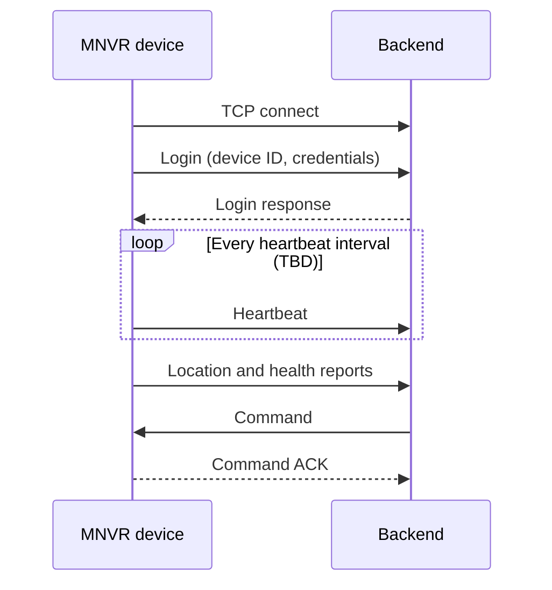

# Device ↔ Backend TCP Protocol

> **Status:** Draft · **Updated:** 2026-09-11 · **Protocol version:** 0.1

Message-level specification for the link described in [Backend Communication (TCP)](../product/features/backend-tcp.md). Nothing here is final; the structure is ready to be filled in.

## Connection

| Item | Value |
|---|---|
| Transport | TCP over 4G |
| Who connects | The device opens the connection; both sides then send messages |
| Encryption | TBD (TLS recommended) |
| Authentication | TBD |
| Heartbeat interval | TBD |
| Reconnect strategy | TBD (for example, retries with increasing delay) |
| Byte order | TBD |

## Message frame

TBD. Choose the message format first (see the open questions on the feature page). If a custom binary format is chosen, a typical frame contains:

| Field | Size | Description |
|---|---|---|
| Start marker | TBD | Marks the start of a frame |
| Message type | TBD | What kind of message this is |
| Sequence number | TBD | Matches replies and ACKs to requests |
| Device ID | TBD | Which device sent it |
| Body length | TBD | Size of the body in bytes |
| Body | variable | The message content |
| Checksum | TBD | Detects corrupted frames |

## Message types (candidate list)

| Message | Direction | Purpose |
|---|---|---|
| Login | Device → Backend | Identify and authenticate after connecting |
| Login response | Backend → Device | Accept or reject the device |
| Heartbeat | Device → Backend | Show the device is online |
| Location report | Device → Backend | Position, speed, heading and time |
| Health report | Device → Backend | CAN values and fault codes |
| Event / alarm | Device → Backend | Panic button, harsh driving, faults, tampering |
| Command | Backend → Device | Change settings, reboot, request video, start a call |
| Command ACK | Device → Backend | Result of a command |
| Video request / response | Both | Live stream or playback (TBD) |

## Flows

## Version history

| Version | Date | Change |
|---|---|---|
| 0.1 | 2026-09-11 | Initial structure; all values TBD |
