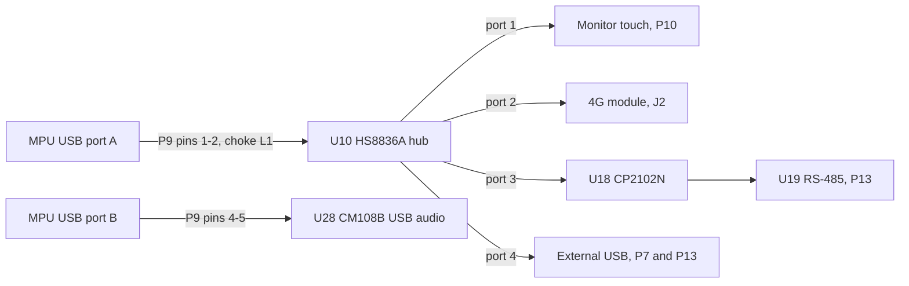

# Communications

> **Status:** Draft · **Updated:** 2026-09-11 · **Source:** baseboard V2.1 schematic, sheets "USB HUB", "GSM MODEM", "GPS MODULE", "USB-RS485 CONVERTER", "RS232" and the top sheet

## USB topology

| Hub port | Device | Notes |
|---|---|---|
| 1 (DM11/DP11) | Monitor touch panel | ESD array U1, out on P10 pins 2/4 |
| 2 (DM12/DP12) | 4G module | J2 pins 36/38 |
| 3 (DM13/DP13) | CP2102N USB-to-UART → RS-485 | Appears to the MPU as a USB serial port (Silicon Labs CP210x driver) |
| 4 (DM14/DP14) | External USB | Choke L2, ESD array U2, fused 5 V (F2); on P7 and on P13 pins 11/13 |

Hub power: +5V through R49 4.7 Ω to Vhub; 3.3 V from the +3.3V rail. Upstream 22 Ω series resistors R50/R51.

The user's description places the touch panel on a direct MPU port and the USB audio on the hub; the schematic shows the reverse. **Open question**, see [MPU Motherboard](../mpu-board.md).

## 4G module (J2)

| Item | Value |
|---|---|
| Socket | Mini PCIe, 52-pin, TE 1759547-1, with two mounting posts |
| Module | Quectel 4G (exact model TBD) |
| Data | USB 2.0 to hub port 2 |
| Voice | PCM (CLK, SYNC, DOUT, DIN) to the ALC5616 codec; I2C to configure the codec |
| Debug | UART RX/TX on header P16 |
| Indicator | LED_WWAN# → D4 green through 300 Ω |
| Power | +3.3V_GSM from U27 (3 A LDO), switched by GSM_PWR_EN from the MPU (P1 pin 6) |
| Control pins | WAKE#, W_DISABLE#, PERST# appear unconnected (verify). Power-cycling +3.3V_GSM is then the only hard reset |

Claude's note: the module reaches the internet for the MPU. How the MPU uses it (USB network interface such as QMI/ECM/RNDIS, or PPP over a serial port) depends on the MPU's OS and is TBD. Voice calls are placed with AT commands over one of the module's USB serial ports (verify).

## SIM and eSIM

- **J3**: physical SIM holder (SIM7100-6-1-15-01-A), ESD protection U7 (SMF05C) and 33 pF filters, 22 Ω series resistors.
- **U9**: eSIM in an MFF2 package, soldered to the board.
- **U8 FSA2567**: switches the module's USIM interface between the eSIM ("SIM1") and the card ("SIM2"). SEL comes from the card-detect pin of J3 with a 10 kΩ pull-up (R48), so inserting a card selects it and removing it falls back to the eSIM (verify polarity).
- R148–R151 (0 Ω, not fitted by default, verify) can bypass the switch and wire the module straight to the card.

## GNSS (U11)

| Item | Value |
|---|---|
| Module footprint | Quectel L89 / L86 / LC86L (the L89 adds IRNSS/NavIC, relevant to AIS-140) |
| Interface | UART to MCU USART2 (PA2/PA3), 1 kΩ series resistors. Default Quectel setting is 9600 baud NMEA (confirm) |
| Wake | WAKE_UP from MCU PA6 |
| Power | +3.3V_GPS, switched by MCU PA7 |
| Backup | V_BCKP from BT1, charged through D7 and R57 |
| Antenna | External, ANT1 through R55 0 Ω to EX_ANT, 10 pF filters, D6 ESD |
| Unused pins | 1PPS, 3D_FIX, AADET_N, JAM_IND, GEO_FENCE, I2C, RESET (all not connected) |

## CAN (two channels)

- The MCU's two CAN controllers (CAN1 on PA11/PA12, CAN2 on PB12/PB13) go at 3.3 V logic to **P5**, the CAN add-on board's MCU-side header, along with +5 V.
- The add-on's transceivers return CAN_H/CAN_L for both channels on **P6**, which is routed to **P13** pins 1–4.
- Transceiver part, isolation and termination are on the add-on board: TBD.
- Bit rate is set in firmware. See [CAN Signal Map](../../code/can-signals.md) for the bus settings and signals.

## RS-485

- U18 CP2102N (USB-to-UART) on hub port 3 → U19 SN65HVD3088E half-duplex transceiver.
- Direction control (DE/RE) is **485_EN**, driven from the CP2102N's GPIO.2/RS485 pin through R115 (0 Ω), which the CP2102N can toggle automatically in RS-485 mode. An alternative source, RS485-EN through R109 (0 Ω), is shown linked to GPIO0 on the top sheet (verify; only one should be fitted).
- Line: 60.4 Ω + 60.4 Ω with 10 nF (AC termination), 4.7 kΩ fail-safe biasing (R104, R114), choke L3, TVS U20 (SM712).
- LEDs D17 (green) and D18 (orange) show TX/RX.
- Out on P13 pins 6 (A) and 8 (B).
- Intended use: TBD (ticketing machine, passenger counter, display board?).

## RS-232

- MCU USART1 (PA9/PA10) → U16 MAX3232, one channel used (T1/R1) → P13 pins 9 (TX) and 7 (RX).
- ESD: U17 PESD15VL2BT. LEDs D15 (green) and D16 (orange).
- Intended use: TBD.

## MPU ↔ MCU UART

- MCU UART4 (PC10 TX, PC11 RX) ↔ P1 pins 5 and 4, 3.3 V logic, 10 Ω series resistors, activity LEDs D9/D10.
- Three extra lines GPIO0–GPIO2 (MCU PA15, PB3, PB4 ↔ P1 pins 1, 3, 8) with no defined meaning yet.
- Message format: see [MPU ↔ MCU UART Protocol](../../code/mpu-mcu-uart.md).
