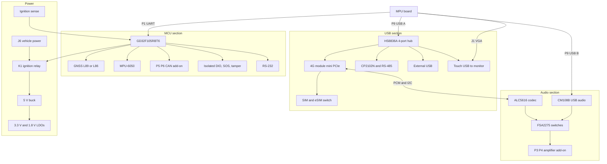

# Baseboard V2.1 Overview

> **Status:** Draft · **Updated:** 2026-09-11 · **Source:** schematic "NVR STM BASEBOARD V2_1" (Altium, dated 11/9/2023 on the drawing; 14 schematic sheets plus a PCB fabrication drawing)

The baseboard is the extension board that the [MPU motherboard](../mpu-board.md) plugs into. It carries the microcontroller, the 4G module, the GNSS receiver, every vehicle-facing interface, the audio hardware and the power supply. "STM" in the file name refers to the MCU: a GigaDevice GD32F105, which is pin- and peripheral-compatible with the STM32F105.

These pages were written from the schematic by Claude. Items marked **verify** are inferred from the drawing rather than printed on it. Component values are quoted as printed.

## What the board does

- Takes battery power and ignition from the vehicle, powers everything including the MPU board, and can keep the system alive after ignition-off under MCU control. See [Power & Ignition](power.md).
- Runs the MCU, which reads GNSS, two CAN channels, the accelerometer, digital inputs, SOS and tamper; drives outputs, LEDs and the power relay; and forwards data to the MPU over UART. See [MCU Pin Map](mcu-pinmap.md).
- Hosts the 4G module with SIM/eSIM, the USB hub, the USB-RS-485 converter and the RS-232 transceiver. See [Communications](comms.md).
- Routes audio for passenger announcements, the driver speaker, the microphone and voice calls. See [Audio Paths](audio.md).
- Brings everything out on connectors. See [Connectors](connectors.md).

## Block diagram

## Main ICs

| Ref | Part | Function | Sheet |
|---|---|---|---|
| U12 | GD32F105RBT6 | MCU, Arm Cortex-M3, LQFP-64 | MCU |
| J2 | Mini PCIe socket (TE 1759547-1) | 4G module (Quectel, exact model TBD) | GSM MODEM |
| U8 | FSA2567 | SIM switch: physical SIM (J3) or eSIM (U9) | GSM MODEM |
| U9 | eSIM (MFF2) | Embedded SIM | GSM MODEM |
| U11 | Quectel L89 / L86 / LC86L | GNSS receiver; the footprint fits any of the three | GPS MODULE |
| U10 | HS8836A | 4-port USB 2.0 hub | USB HUB |
| U18 | Silicon Labs CP2102N | USB to UART, feeding the RS-485 transceiver | USB-RS485 CONVERTER |
| U19 | TI SN65HVD3088E | RS-485 transceiver, half duplex | USB-RS485 CONVERTER |
| U16 | MAX3232 | RS-232 transceiver on MCU USART1 | RS232 |
| U6 | Realtek ALC5616 | Audio codec for voice calls; PCM audio and I2C control from the 4G module | CODEC |
| U28 | C-Media CM108B | USB audio: MPU sound output and microphone input | USB-AUDIO |
| U4, U5 | FSA2275 | Analogue audio switches for speaker and microphone routing | AUDIO SWITCH |
| U13 | InvenSense MPU-6050 | 3-axis gyroscope + 3-axis accelerometer on the MCU's I2C | GYRO-ACC |
| U14, U15 | TCMT4100 | Quad optocouplers for isolated digital inputs, outputs, SOS and tamper | DIG IO |
| U24 | TI TPS5450 | 12 V → 5 V buck converter | POWER SUPPLY |
| U27 | MIC29302 | 5 V → 3.3 V, 3 A LDO for the 4G module | POWER SUPPLY |
| U25, U26 | TI TLV75733 | 5 V → 3.3 V LDOs for GNSS and MCU, individually enabled | POWER SUPPLY |
| U22, U23 | TI TPS73033, TPS73018 | 3.3 V and 1.8 V for the codec | POWER SUPPLY |
| U21 | TI LM2596S-3.3 | Ignition-sense supply: 3.3 V derived from the ignition line | POWER RELAY |
| K1 | Relay | Switches +12 V to the whole system; driven by ignition or by the MCU | POWER RELAY |

## Not on the baseboard

| Item | Where | Connector |
|---|---|---|
| CAN transceiver | [CAN add-on board](../addons/can.md): SN65HVD1050, channel 1 only on the known board | P5 (MCU side), P6 (bus side) |
| Audio power amplifier | [Amplifier add-on board](../addons/amplifier.md): TPA3116D2 class-D | P3 (inputs and power), P4 (outputs) |
| 24 V → 12 V converter | External module wired through J6 (verify) | J6 |
| MPU motherboard | Plugs in via P1, P9, P11, J1 | |
| Monitor with touch | Cable | P10 |
| Cameras | On the MPU board | |
| Speakers, microphone, digital I/O | Vehicle harness | P14 |
| CAN, RS-485, RS-232, SOS, external USB | Vehicle harness | P13 |
| GNSS antenna | | ANT1 |

## Schematic sheets

1. Top sheet (block interconnect, connectors, mounting holes, fiducials)
2. Audio switch
3. Codec
4. GSM modem and SIM card interface
5. USB hub
6. GPS module
7. MCU
8. Gyro-acc
9. DIG IO
10. RS232
11. USB-RS485 converter
12. Power relay (power input, ignition sense, ignition relay)
13. Power supply
14. USB-audio
15. PCB fabrication drawing (layer stack, impedance table, fab notes)

## Source file

The schematic PDF belongs at `docs/hardware/files/NVR-STM-BASEBOARD-V2_1.pdf` ([open](../files/NVR-STM-BASEBOARD-V2_1.pdf)). If the link fails, the file has not been copied into the repository yet.
