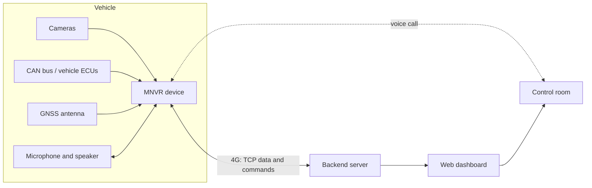

# System Architecture

> **Status:** Draft · **Updated:** 2026-09-11

A first sketch based on the product description. Update it as the design is decided.

## Overview

## Components

| Component | Role | Tech |
|---|---|---|
| MNVR device | Records video, reads GNSS and CAN, talks to the backend, handles calls | TBD |
| Backend server | Accepts device connections, stores data, sends commands | TBD |
| Web dashboard | Map, live status, video, alerts and health data for operators | TBD |

## Data flows

1. The device connects to the backend and logs in.
2. The device sends location, health data and events on a schedule or when something happens.
3. The backend sends commands; the device acknowledges each one.
4. Video stays on the device until the backend requests it (live or recorded). How this works is TBD.
5. Voice calls run between the vehicle and the control room. The path is TBD: see [Voice Calls](features/voice-calls.md).

## Open questions

- Is the backend part of this product, or does MNVR integrate with an existing platform?
- Hosting for the backend: cloud or on-premises?
