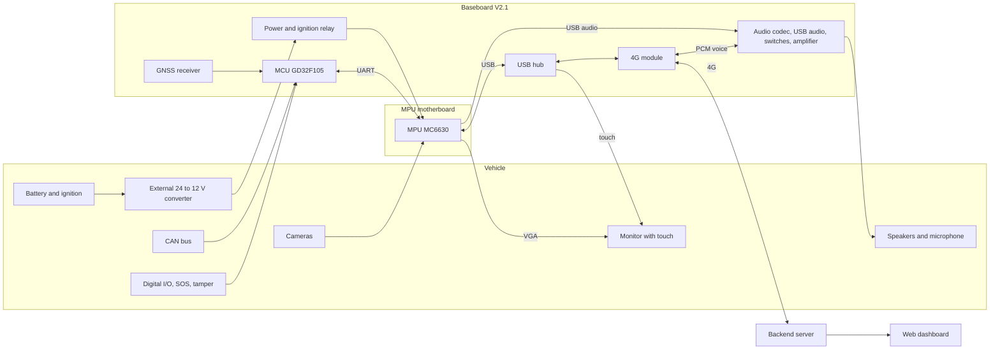

# System Architecture

> **Status:** Draft · **Updated:** 2026-09-11

Based on the product description and the baseboard V2.1 schematic. The backend and dashboard are still undefined.

## Overview

## Components

| Component | Role | Tech |
|---|---|---|
| MPU motherboard | Display and touch, cameras and recording, announcements, data processing, backend link | MC6630 (TBD), OS TBD |
| Baseboard | Power, MCU, 4G, GNSS, CAN, I/O, audio hardware | GD32F105RBT6 MCU; see [Baseboard Overview](../hardware/baseboard/overview.md) |
| Backend server | Accepts device connections, stores data, sends commands | TBD |
| Web dashboard | Map, live status, video, alerts and health data for operators | TBD |

## Division of work between the two processors

| Task | MCU (baseboard) | MPU (motherboard) |
|---|---|---|
| Ignition sensing, power hold after ignition-off | Senses ignition, holds the relay | Asks the MCU to keep power while it shuts down (protocol TBD) |
| GNSS | Reads the receiver over UART | Receives position from the MCU, processes it, sends it to the backend |
| CAN vehicle data | Reads both CAN channels | Receives parameters from the MCU, processes them, sends them to the backend |
| Accelerometer, digital inputs, SOS, tamper, battery voltage | Reads them | Receives events from the MCU |
| Digital outputs, status LEDs, RS-232 | Drives them | Requests via the MCU (TBD) |
| Cameras, video recording, display, touch | | Owns them |
| Next-stop announcements | | Plays audio through the USB audio chip |
| Backend communication | | Owns it, through the 4G module on USB |
| Voice calls | | Controls the 4G module and the audio switches |

## Data flows

1. Ignition on → relay closes → the baseboard powers the MPU board. The MCU can hold power after ignition-off so the MPU can shut down cleanly.
2. The MCU streams GNSS position, CAN parameters and events to the MPU over UART ([MPU ↔ MCU UART Protocol](../code/mpu-mcu-uart.md)).
3. The MPU connects to the backend through the 4G module and sends location, health data and events; the backend sends commands ([Device ↔ Backend TCP Protocol](../code/tcp-protocol.md)).
4. Video stays on the MPU board until the backend requests it (live or recorded). How this works is TBD.
5. Voice calls run through the 4G module's PCM audio interface and the baseboard codec ([Audio Paths](../hardware/baseboard/audio.md)).

## Open questions

- Is the backend part of this product, or does MNVR integrate with an existing platform?
- Hosting for the backend: cloud or on-premises?
