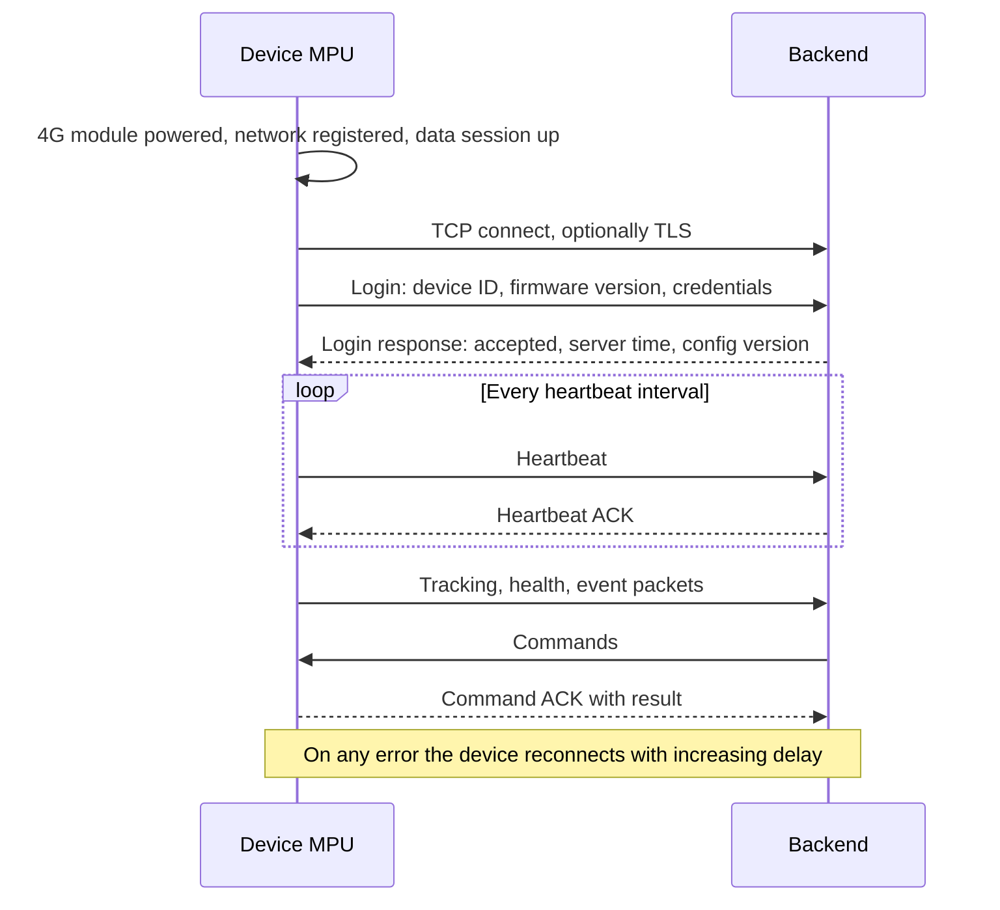

# Backend Communication: Overview & Flow

> **Status:** Draft · **Updated:** 2026-09-11

How the device talks to the backend: the persistent two-way TCP link for packets, and the FTP path for video files. The MPU owns this section; the 4G module on the baseboard provides the network.

## Known so far

Given by the product owner:

- Two-way TCP communication with the backend.
- Tracking packets and health-parameter packets exist; other packets will be described later.
- Video clips are uploaded to the backend by FTP on a panic press.

Everything else is a proposal to review. The packet list is in the [Packet Catalogue](packets.md); the byte-level framing belongs in the [Device ↔ Backend TCP Protocol](../../code/tcp-protocol.md).

## Flow 1: connection lifecycle

1. After boot the MPU powers the 4G module (GSM_PWR_EN), waits for network registration and brings up the data session (APN from settings).
2. It opens a TCP connection to the primary server; if that fails, to the backup server (proposed).
3. It logs in with its device ID and credentials. The backend replies with acceptance, its time (used to check the device clock) and the current configuration version.
4. Heartbeats keep the connection alive and detect a dead link from either side.
5. Packets flow in both directions. Every command from the backend is acknowledged with a result.
6. On connection loss the device reconnects with increasing delays (proposal: 5 s, 10 s, 30 s, 60 s, then every 60 s) and re-logs-in.

## Flow 2: tracking packets

1. The MCU sends GPS fixes to the MPU about once per second.
2. The MPU sends a tracking packet at the configured interval (proposal: every 10 s while moving, every 60 s while stopped, and immediately on ignition change, heading change above a threshold, or an event).
3. Each packet carries position, speed, heading, time, fix quality, ignition state and whatever else is decided (see the catalogue).
4. While offline, tracking packets are stored and sent later in order, marked as historical.

## Flow 3: health packets

1. The MPU receives CAN health records from the MCU ([CAN Health Monitoring](../can-health/overview.md)).
2. It sends a health packet at its interval (proposal: 60 s) and an event packet immediately when a threshold or fault alert is raised or cleared.
3. Device health (storage, cameras, temperature, battery voltages, signal strength) is included in the same packet or a separate one: decide.

## Flow 4: events and alarms

SOS, harsh driving, digital input changes, tamper, geofence, route deviation, video loss and similar produce an event packet immediately, with the position and time. The backend acknowledges; unacknowledged events are resent.

## Flow 5: commands from the backend

Examples: change a setting, push a content package, request a live stream or a clip, start a call, set a digital output, reboot, update firmware. The device validates the command, executes it, and replies with an ACK carrying the result. Long operations (firmware or content download) report progress and a final result.

## Flow 6: file transfers

- Uploads (video clips, snapshots, logs) go to the backend FTP server, with a notification over TCP when a file is complete ([Camera Management](../camera/overview.md)).
- Downloads (content packages, firmware) come from a URL or FTP path given in a command, are verified by checksum, and are applied under the rules of the section that owns them.

## Flow 7: store-and-forward

Every outgoing packet is written to a persistent queue before sending. The queue survives reboots and is drained in order after reconnection, with a cap on size and age. Real-time packets (current position, alarms) are sent before backlog (proposed).

## Security (to decide)

- TLS on the TCP link, or a lighter scheme.
- Device authentication: per-device credentials provisioned at manufacture, rotated by the backend.
- FTP credentials: per device, not shared; consider SFTP or FTPS.
- Commands authenticated so a spoofed server cannot control the bus.

## Decisions needed

- Message format: custom binary, JSON, or an existing standard (JT/T 808 and JT/T 1078, or the AIS-140 protocol where mandated).
- Intervals: heartbeat, tracking (moving, stopped), health.
- Primary and backup server addressing; DNS or fixed IPs.
- Which packets exist beyond tracking and health (the owner will describe them).
- Monthly mobile data budget per vehicle, which constrains video and reporting rates.

## Related

- [Packet Catalogue](packets.md)
- [Functionality Checklist](checklist.md)
- [Backend Communication (TCP)](../../product/features/backend-tcp.md) (requirements page)
- [Device ↔ Backend TCP Protocol](../../code/tcp-protocol.md)
