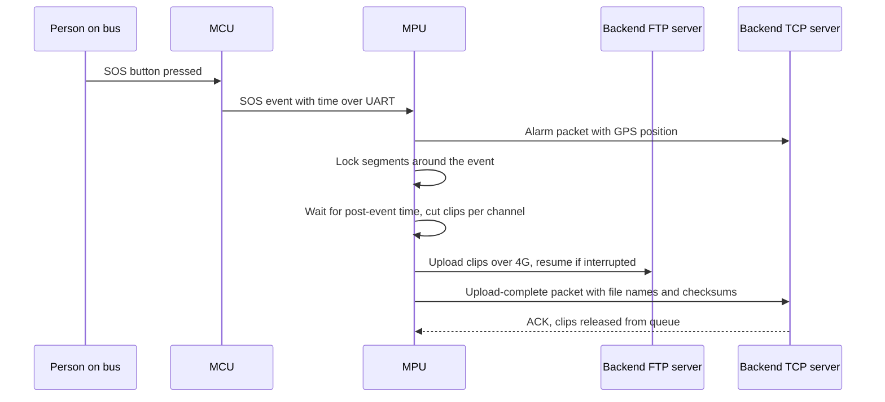

# Camera Management: Overview & Flow

> **Status:** Draft · **Updated:** 2026-09-11

Everything from the cameras on the bus to a video clip arriving on the backend server. The MPU owns this whole section; the MCU only supplies triggers (SOS button, ignition, digital inputs) and the GPS position stamped on the video.

## Known so far

Given by the product owner:

- 8 camera channels are integrated on the MPU board.
- On a panic (SOS) button press, video is uploaded to the backend over FTP.
- Live view and playback are on the touch monitor (from the product description; details TBD).

Everything else on this page and in the [Functionality Checklist](checklist.md) is a proposal to review.

## Flow 1: start-up and continuous recording

1. Ignition on → the baseboard relay powers the MPU board.
2. The MPU boots and loads the camera configuration: which channels are enabled, resolution, frame rate, bitrate.
3. It enumerates the 8 channels. A channel with no signal is marked "video loss", retried periodically, and reported.
4. It checks storage: mounted, free space, health. If full, the oldest unlocked segments are deleted first.
5. Recording starts on every enabled channel into fixed-length segment files (proposal: 1–5 minutes each). Each frame carries an overlay with time, vehicle ID, channel name, GPS position and speed.
6. Every segment is indexed in a local database so playback and clip extraction can find footage by time.
7. Recording runs until ignition off. The MCU holds power for a configurable time so the MPU can close the current segments cleanly before power is cut (see [Power & Ignition](../../hardware/baseboard/power.md)).

## Flow 2: panic (SOS) press → clip → FTP upload

1. The SOS button closes to ground; the MCU reads it on PB15, debounces it and sends an SOS event with its timestamp to the MPU over UART.
2. The MPU records the event with the current GPS position and immediately sends an alarm packet to the backend over TCP (see [Backend Communication](../backend/overview.md)).
3. The MPU locks the recording segments around the event so loop recording cannot overwrite them.
4. After the post-event time has elapsed, it cuts one clip per configured channel: pre-event N seconds plus post-event M seconds (proposal: 30 s + 60 s).
5. The clips go into a persistent upload queue that survives reboots and power loss.
6. The uploader connects to the backend FTP server over the 4G link and uploads each clip. File names identify vehicle, channel, event type, event ID and start time. Interrupted uploads resume rather than restart.
7. On success the MPU tells the backend which files arrived, with checksums; the backend acknowledges; the queue entry is cleared and the lock is released after the retention time.
8. If the device is offline, the queue retries with increasing delays until it succeeds. Locked segments are never deleted before upload and acknowledgement.

## Flow 3: live view and playback on the monitor

- The default screen is a grid of live channels. Touching a tile shows that channel full screen; touching again returns to the grid.
- Playback: the driver or technician picks a channel and a date/time from a timeline that shows recorded and event footage, then plays, pauses, seeks, changes speed, or takes a snapshot.
- Export: select a time range and channels, then export to a USB drive on the external USB port, with progress shown.
- Access control (proposal): playback and export behind a PIN, so passengers or unauthorised staff cannot browse footage.

## Flow 4: remote access from the backend (proposed, TBD)

- The backend requests a live stream of one channel; the MPU streams it (protocol TBD, for example RTSP) with a bandwidth cap suited to 4G.
- The backend requests a clip for a time range; it goes through the same queue and FTP path as panic clips.
- The backend queries recording status and storage usage.

## Flow 5: health monitoring

Video loss, storage errors, stalled recording and over-temperature produce an on-screen indicator and an alert packet to the backend. Recording state is also shown on a status LED.

## Decisions needed

- Camera type and interface (AHD, IP, other), resolution, frame rate and codec per channel.
- Storage type and capacity; how many days of footage must be kept.
- Pre- and post-event durations, and which channels are uploaded on SOS.
- FTP, or a secured variant (SFTP/FTPS); how credentials are provisioned.
- Whether live streaming to the backend is needed in the first release.

## Related

- [Functionality Checklist](checklist.md)
- [Video Surveillance](../../product/features/video-surveillance.md) (requirements page)
- [MPU Motherboard](../../hardware/mpu-board.md)
- [Backend Communication](../backend/overview.md)
