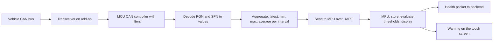

# CAN Health Monitoring: Overview & Flow

> **Status:** Draft · **Updated:** 2026-09-11

From raw frames on the vehicle's CAN bus to health values on the backend and warnings on the driver's screen. The MCU reads the bus; the MPU processes the values and sends them to the backend.

## Known so far

Given by the product owner:

- The MCU reads vehicle parameters from CAN and passes them to the MPU, which processes them and sends them to the backend.
- Hardware: two CAN controllers on the MCU; the known [CAN add-on](../../hardware/addons/can.md) serves channel 1 with an SN65HVD1050 transceiver.

Everything else is a proposal to review. The parameter list is on the [CAN Signal Map](../../code/can-signals.md).

## Flow 1: bus set-up

1. The MCU reads the CAN configuration for the vehicle type: bit rate (J1939 is normally 250 kbit/s), which channel is connected to which bus, and the list of message IDs (PGNs) to accept.
2. The controller is put into listen-only (silent) mode so the device can never transmit onto the vehicle bus (proposed as the default; see decisions).
3. Hardware filters accept only the configured message IDs, so the MCU is not flooded.
4. If no frames arrive within a timeout while the ignition is on, the MCU reports "CAN silent" to the MPU.

## Flow 2: decode and aggregate

1. Each accepted frame is decoded into engineering values (rpm, km/h, °C, kPa, %, V) using the signal map.
2. Values are aggregated per reporting interval: latest, minimum, maximum and average, plus a "stale" flag if a value has not been updated within its expected period.
3. Fault codes (J1939 DM1 active DTCs) are collected as a list of SPN and failure-mode pairs.
4. At the reporting interval (proposal: every 10 s to the MPU) the MCU sends a health record to the MPU over UART.
5. The MPU stores the record locally (for offline periods), evaluates thresholds, and sends a health packet to the backend at its own interval (proposal: every 60 s, plus immediately on alert).

Decision to make: does the MCU decode J1939 itself, or forward raw frames for the MPU to decode? Decoding on the MCU keeps the UART traffic small; decoding on the MPU makes the signal map easier to update.

## Flow 3: thresholds and alerts

1. Each value can have warning and critical limits (for example coolant temperature above 100 °C, oil pressure below a minimum at running rpm, battery voltage below 22 V on a 24 V system).
2. A limit must be exceeded for a minimum time before an alert is raised, to avoid noise.
3. An alert produces: an on-screen warning for the driver, an event packet to the backend, and optionally a status LED change.
4. The alert clears when the value returns inside the limit for a minimum time; a "cleared" event is sent.
5. New active fault codes raise a fault event with the code and description if known.

## Flow 4: driver display

- A vehicle health screen on the touch monitor shows live values, warnings and active fault codes.
- Warnings appear as a banner or icon on any screen; tapping opens the health screen.

## Flow 5: offline and history

- Health records are stored locally for a configurable number of days and sent to the backend when connectivity returns (store-and-forward, oldest first or newest first: decide).
- Trip summaries (distance, fuel used, engine hours, maximum speed, alert counts) computed at trip end (proposed).

## Decisions needed

- Vehicle makes and models; confirm each uses J1939 and which PGNs it actually transmits.
- Listen-only, or is the device ever allowed to send requests (for example to read fault codes on demand)?
- Where decoding happens (MCU or MPU).
- Reporting intervals to the MPU and to the backend.
- Which thresholds are set on the device, and which are evaluated on the backend.
- Whether a second CAN channel is needed, and for what (a second vehicle bus, a body controller, a fuel sensor).

## Related

- [Functionality Checklist](checklist.md)
- [Vehicle Health (CAN)](../../product/features/vehicle-health-can.md) (requirements page)
- [CAN Signal Map](../../code/can-signals.md)
- [CAN Add-on](../../hardware/addons/can.md)
