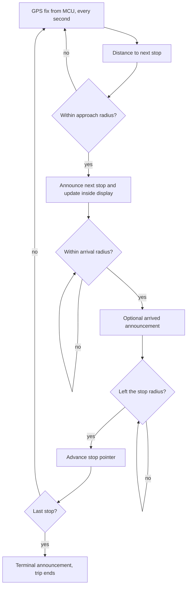

# PIS Management: Overview & Flow

> **Status:** Draft · **Updated:** 2026-09-11

PIS is the Passenger Information System: what passengers see on the LED display boards and hear from the speakers. It has two sub-areas, [LED Display Updates](led-display.md) and [Audio Announcements](audio-announcements.md), and both depend on route data.

## Known so far

Given by the product owner:

- Automatic voice announcements (next stop), running through to manual route updates by the driver.
- Two kinds of update: LED updates and audio updates.
- Hardware: announcements play through the MPU's USB audio → audio switch → amplifier → passenger speakers ([Audio Paths](../../hardware/baseboard/audio.md)).

Everything else is a proposal to review. The LED boards' connection and protocol are TBD; the RS-485 port on the baseboard is the likely link.

## Concepts

| Term | Meaning |
|---|---|
| Route | Route number and name, direction (up/down), and an ordered list of stops |
| Stop | Name in each language, GPS coordinates, geofence radius, display text, audio file(s) |
| Trip | One run of a route in one direction |
| Announcement | A message played to passengers: next stop, arrived, welcome, terminal, safety, ad-hoc |
| Content package | The route data, display texts and audio files for a set of routes, with a version number |

## Flow 1: route data

1. The backend holds the route master and pushes content packages (routes, stops, texts, audio) to the device; the device stores them with a version number ([Backend Communication](../backend/overview.md)).
2. The driver can also select or change the route manually on the touch screen **[given]**.
3. The device reports the active route and direction to the backend when a trip starts (proposed).

## Flow 2: trip start

1. The driver selects the route and direction on the touch screen (optionally after logging in) and taps Start.
2. The MPU sends the route number and destination to every LED board (front, side, rear, inside).
3. A welcome announcement plays.
4. The stop pointer is set to the first stop, or to the nearest stop by GPS position (proposed).

## Flow 3: automatic announcements while moving

1. The MCU sends GPS fixes to the MPU about once a second.
2. The MPU computes the distance to the next stop on the active route.
3. When the bus enters the approach radius (proposal: 300 m, configurable per stop), it plays the "next stop" announcement in each configured language and shows the stop on the inside display.
4. When the bus enters the arrival radius (proposal: 50 m), it can play an "arrived" announcement.
5. When the bus leaves the stop radius, the pointer advances to the next stop.
6. Each announcement is played once per stop per trip; a time and distance hysteresis prevents repeats when GPS jitters at the boundary.
7. If a stop is skipped, the pointer catches up when a later stop's radius is entered.
8. If the bus leaves the route corridor for longer than a threshold, a route-deviation event is raised (proposed) and announcements pause until the bus is back on route.
9. At the last stop a terminal announcement plays and the trip ends. The driver selects the return direction, or the device proposes it.

## Flow 4: manual control by the driver

- Next stop, previous stop, repeat the announcement.
- Change route or direction mid-trip **[given: manual route update]**.
- Mute or lower announcements temporarily.
- Play a preset message (safety, delay, diversion).
- Public address through the microphone (proposed; uses the mic → USB audio path).

## Flow 5: LED and audio content updates

1. The backend publishes a new content package version.
2. The device downloads it over 4G in the background, verifies the checksum, and stores it beside the current version.
3. The package is applied at trip end (or immediately if the backend says so).
4. The device reports the active version to the backend. If applying fails, it keeps the previous version and reports the error.

## Audio priority

Announcements share the speaker path with voice calls and alarms. Proposed order, highest first: voice call, emergency/safety message, next-stop announcement, promotional or informational message. A higher-priority source interrupts a lower one; the interrupted announcement is repeated if still relevant.

## Decisions needed

- LED board models, connection and protocol; whether an inside next-stop display exists.
- Languages, and whether announcements are pre-recorded files or generated by text-to-speech.
- Default approach and arrival radii.
- Audio file format and where content packages are produced.
- Whether trips must be reported to the backend (start, stop, stop-by-stop times).

## Related

- [LED Display Updates](led-display.md)
- [Audio Announcements](audio-announcements.md)
- [GPS Tracking](../../product/features/gps-tracking.md)
- [Audio Paths](../../hardware/baseboard/audio.md)
